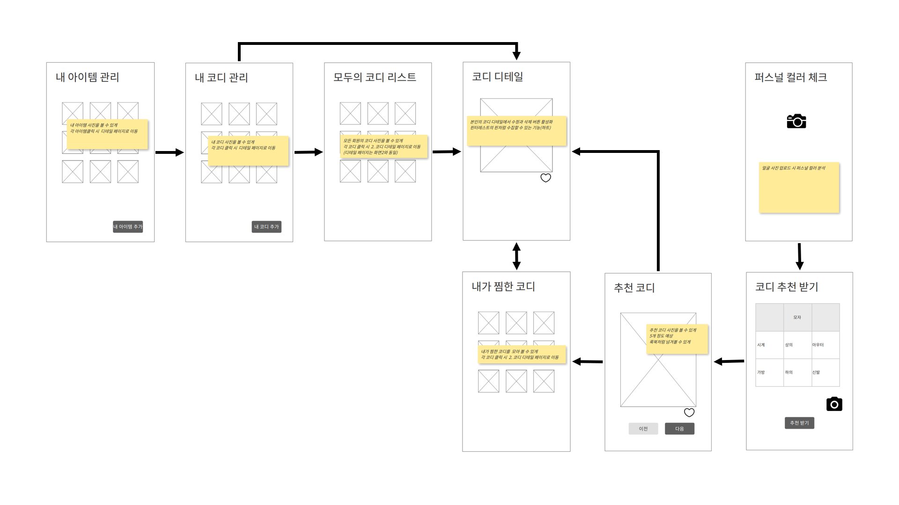
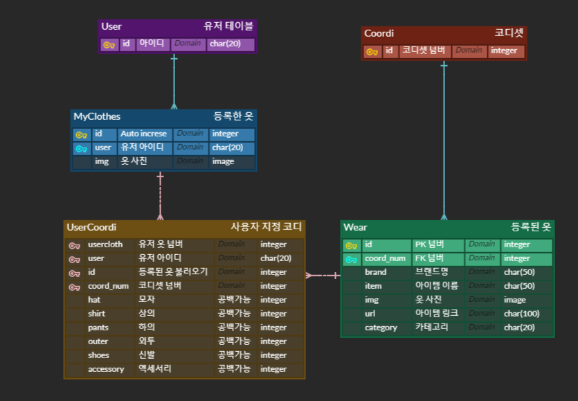

# 프로젝트 허성수

> AI 기반의 코디 추천 서비스

1. 주요 고객층 선정
   - 패션에 큰 관심이 없는 20대 남성
   - 옷(패션)을 어려워하는 사람
   - 특정 상황/컨셉에 맞는 옷차림을 입고 싶어한다.
2. 이미지 메이킹(퍼스널컬러) 색상 가중치(유저 정보)를 활용한 코디 추천
3. 일정에 맞는 코디세트 추천
   - 만나는 사람과 상황에 따른 코디 추천
     - 만나는 사람: 혼자 / 친구 / 여사친 / 교수님 등
     - 상황: 학교 / 아르바이트 / PC방 / 발표 및 프레젠테이션 /  결혼식 / 장례식 등
4. 유저의 코디 중 좋아요를 50개 이상 받은 코디는 추천 set에 추가
5. 1차 배포 일정(일정 수립): 30일(AI 제외하고라도)


# 계획서

-  [계획서.pdf](README_asset/계획서.pdf) 


# 와이어프레임

- 
- [와이어프레임.pdf](README_asset/와이어프레임.pdf) 
- [화면설계.pdf](README_asset/화면설계.pdf) 


# DB 모델링




# R&R

| Back-End    | Front-End       | A.I.               |
| ----------- | --------------- | ------------------ |
| 허성수 (AI) | 조규성 (부팀장) | 박도희 (팀장)      |
|             | 정승희 (UI/UX)  | 박인영 (깃 마스터) |


# 개발 규칙

- Git: git flow branch 전략

- commit message

  ```
  UPDATE | 변경 행위 자세히 
  CREATE | 만든거
  DELETE | 지운거
  BUG | 버그픽스
  지라는 무조건 뒤에 붙이기
  ex) UPDATE | changed oo function | #지라넘버
  ```

- 코드 컨벤션

  ## 공통

  

  #### indent (들여쓰기)

  - html, css, js - space 2
  - python - space 4

  

  #### 연산자

  - 앞뒤로 공백 필요

  - ``` javascript
    // 나쁜 예
    for(i=0, i<10, i++){}
    
    // 좋은 예
    for (i = 0, i < 10, i++) {}
    
    ```

  

  #### 주석은 윗줄을 비우고 독립된 줄에 작성해 주세요

  - ``` javascript
    // 나쁜 예1
    if (age > 20) {
      showAdultMovie(); // 이 줄은 나이가 20살 이상일 때만 실행됩니다.
    }
    
    // 나쁜 예2
    if (age > 20) {
      // 이 줄은 나이가 20살 이상일 때만 실행됩니다.
      showAdultMovie();
    }
    
    // 좋은 예
    if (age > 20) {
        
      // 이 줄은 나이가 20살 이상일 때만 실행됩니다.
      showAdultMovie();
    }
    
    
    ```

  

  #### 따옴표

  - 문자열은 무조건 큰 따옴표로 묶습니다

  - ``` python
    # 나쁜 예
    name = '허성수'
    
    # 좋은 예
    name = "허성수"
    ```

  

  #### 여는 괄호 다음과 닫는 괄호 이전에 공백은 없습니다

  - ``` javascript
    // 나쁜 예
    var isSpace = ( space <= 10 );
    
    // 좋은 예
    var isSpace = (space <= 10);
    ```

  

  #### 다중 속성은 한줄에 적지 않습니다

  - ``` html
    <!-- 나쁜 예 -->
    
    <MyComponent foo="a" bar="b" baz="c"/>
    
    <!-- 좋은 예 -->
    
    <MyComponent
      foo="a"
      bar="b"
      baz="c"
    />
    ```

  

  ## Django

  

  #### 1. 함수, 변수, 모듈명, 속성은 소문자로 스네이크 표기법을 사용하세요

  - ``` python
    # 나쁜 예 (카멜 표기법 사용)
     def addNumber(self, number):
        self.result += num
        return self.result 
    
    # 좋은 예
     def add_number(self, number):
        self.result += num
        return self.result 
    ```

  

  #### 2. 클래스는 대문자로 시작하는 카멜 표기법을 사용하세요

  - ``` python
    # 나쁜 예1 (소문자 카멜 표기법)
    class calculatorMachine:
     def __init__(self):
        self.result = 0
        
    # 나쁜 예2 (스네이크 표기법)
    class calculator_machine:
     def __init__(self):
        self.result = 0
    
    # 좋은 예
    class CalculatorMachine:
     def __init__(self):
        self.result = 0
    ```

  

  

