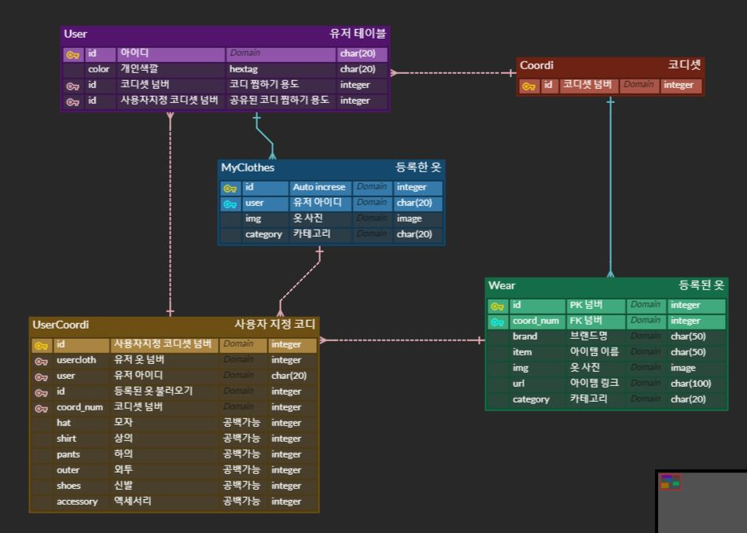

# 쇼체크 탈출

- 목적: 패션에 큰 관심이 없는 20대 남성을 위한 AI 기반의 코디 추천 서비스

- 개발 기간: 20.10.12. ~ 20.11.16.

- [배포 링크](https://k3d205.p.ssafy.io/swagger/)

  

---

## 목차

- [1. 프로젝트 계획 및 계획서](#프로젝트-계획-및-계획서)

- [2. 팀 구성원 및 업무 분장](#팀-구성원-및-업무-분장)

- [3. 와이어 프레임](#와이어-프레임)
- [4. DB 모델링](#DB-모델링)
- [5. 핵심 기능](#핵심-기능)
- [6. 개발 스택 및 프레임 워크](#개발-스택-및-프레임-워크)
- [7. 느낀점](#느낀점)

---

## 프로젝트 계획 및 계획서

- [계획서.pdf](doc/계획서.pdf) 

1. 주요 고객층 선정 
   - 패션에 큰 관심이 없는 20대 남성
   - 옷(패션)을 어려워하는 사람.
   - 특정 상황/컨셉에 맞는 옷차림을 입고 싶어한다.
   
2. 이미지 메이킹(퍼스널컬러) 색상 가중치(유저 정보)를 활용한 코디 추천

3. 일정에 맞는 코디세트 추천
   - 만나는 사람과 상황에 따른 코디 추천
     - 만나는 사람: 혼자 / 친구 / 여사친 / 교수님 등
     - 상황: 학교 / 아르바이트 / PC방 / 발표 및 프레젠테이션 /  결혼식 / 장례식 등
   
4. 유저의 코디 중 좋아요를 50개 이상 받은 코디는 추천 set에 추가

   

---

## 팀 구성원 및 업무 분장

**박도희**

- 팀장
- 이미지프로세싱

**조규성**

- 부팀장
- Frontend 전반

**박인영**

- 깃마스터
- 추천 알고리즘 설계

**허성수**

- Backend API 전반
- 이미지 해싱

---

## 와이어 프레임

- [와이어프레임.pdf](doc/와이어프레임.pdf) 
- [화면설계.pdf](doc/화면설계.pdf) 

---

## DB 모델링

---

## 핵심 기능

**기존의 천편일률적인 코디셋 추천에서 나아가 내가 가진 옷을 바탕으로 각 유저의 퍼스널컬러와 유저의 TPO에 맞추어 코디 추천**

dblib를 사용하여 얼굴 분석 후 퍼스널 컬러 진단(봄웜톤/여름쿨톤/가을웜톤/겨울쿨톤)

OpenCV를 사용해 유저가 올린 이미지의 배경을 지우고 중앙 정렬 및 저장

image hash 기법을 통해 유저가 올린 사진과 DB의 데이터간 유사도 분석 후 추천 모델사용

장소 & 동행의 카테고리를 통해 1차적으로 필터링 후 유사도 분석을 통해 후보군 결정

추천알고리즘 (내용 쓰면됨)

---

## 개발 스택 및 프레임 워크

---

## 느낀점

**박도희**

- 1
- 2

**허성수**

- 1
- 2

**조규성**

- 1
- 2

**박인영**

- 1
- 2

---

